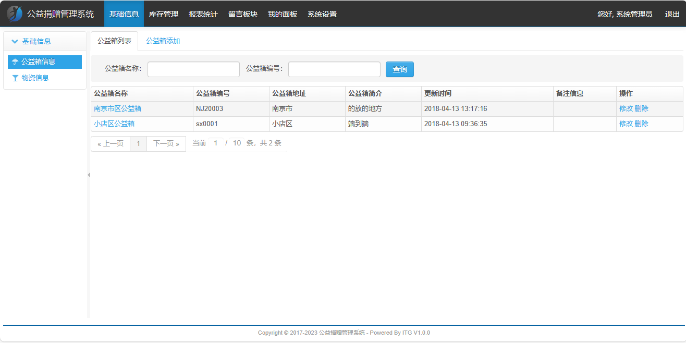
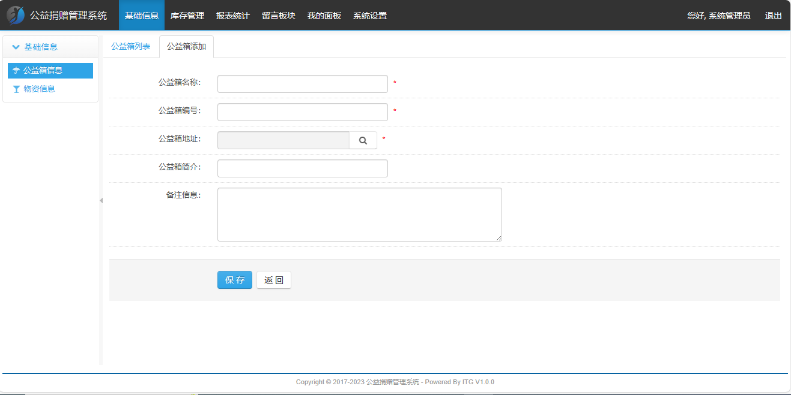
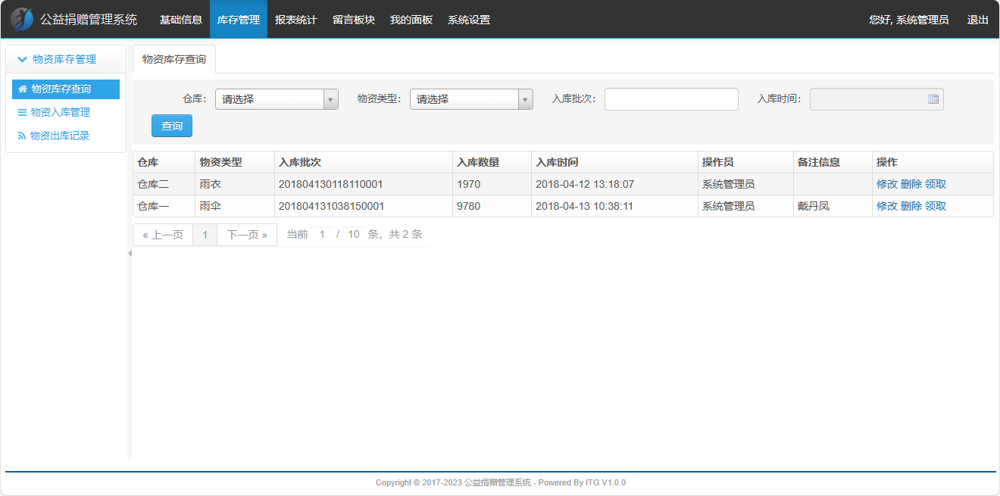
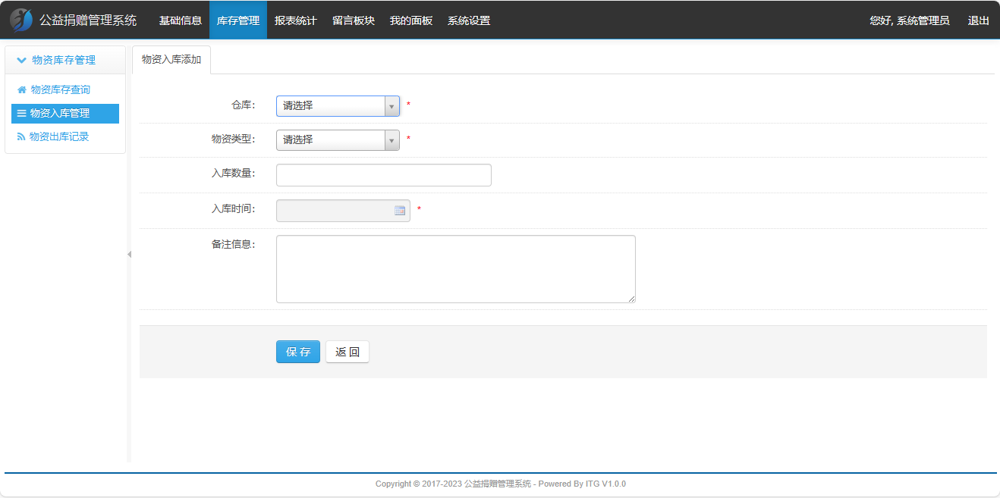
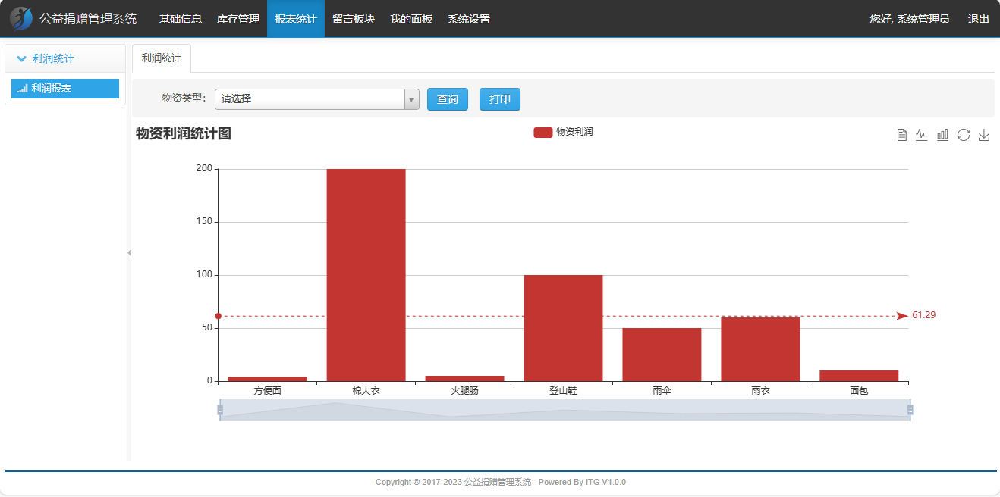
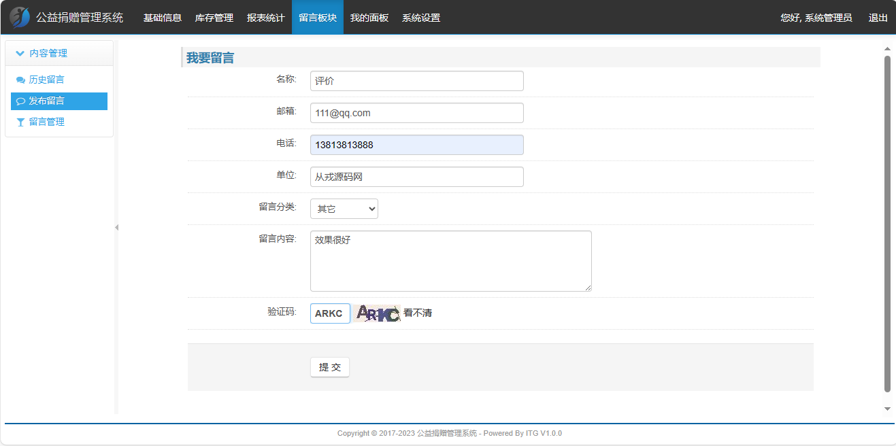
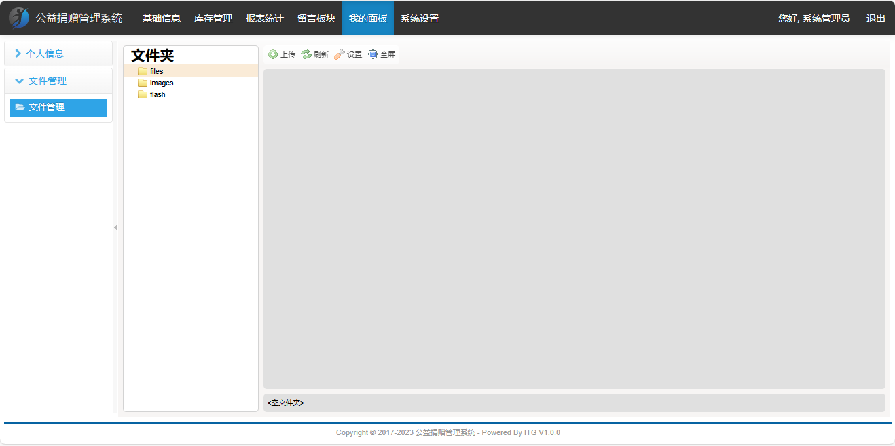

<h1 align="center">36.基于ssm的公益捐赠管理系统</h1>

- <b>完整代码获取地址：从戎源码网 ([https://armycodes.com/](https://armycodes.com/))</b>
- <b>技术探讨、资料分享，请加QQ群：692619798</b> 
- <b>作者微信：19941326836  QQ：952045282</b> 
- <b>承接计算机毕业设计、Java毕业设计、Python毕业设计、深度学习、机器学习</b>
- <b>选题+开题报告+任务书+程序定制+安装调试+论文+答辩ppt 一条龙服务</b>
- <b>所有选题地址 ([https://github.com/YuLin-Coder/AllProjectCatalog](https://github.com/YuLin-Coder/AllProjectCatalog)) </b>

## 项目介绍
基于ssm的公益捐赠管理系统：前端jsp、jquery，后端 spring、mybatis，集成库存管理、统计报表、留言板、公益箱等功能于一体的公益捐赠信息系统。

## 功能介绍

- 基本功能：登录、退出、个人信息查看、个人信息修改、头像上传、密码修改
- 公益箱信息：公益箱列表、关键词搜索、公益箱信息修改、公益箱信息删除、公益箱详情
- 物资信息：物资列表、物资信息修改、物资信息删除、关键词搜索、物资添加
- 库存管理：物资入库添加、物资库存查询、关键词搜索、物资库存信息修改、物资库存信息删除、物资领取、物资出库记录列表、物资出库记录删除
- 报表统计：物资类型条件查询、物资利润统计图打印、柱状图、折线图、数据视图
- 留言板块：历史留言、发布留言、留言列表、关键词搜索、留言审核
- 用户管理：用户列表、用户信息添加、用户信息修改、用户信息删除、用户冻结、用户解冻、用户导出、用户导入
- 机构管理：机构树形列表、机构添加、机构修改、机构删除、添加下级机构
- 区域管理：区域列表、区域添加、区域树形结构、区域修改、区域删除、添加下级区域
- 菜单管理：菜单列表、菜单添加、菜单修改、菜单删除、添加下级菜单
- 角色管理：角色列表、角色添加、角色详情、角色修改、角色分配、角色删除
- 字典管理：字典列表、字典添加、关键词搜索、字典修改、字典删除、添加键值
- 日志查询：关键词搜索、日志列表

## 环境

- <b>IntelliJ IDEA 2009.3</b>

- <b>Mysql 5.7.26</b>

- <b>Tomcat 7.0.73</b>

- <b>JDK 1.8</b>

## 运行截图

